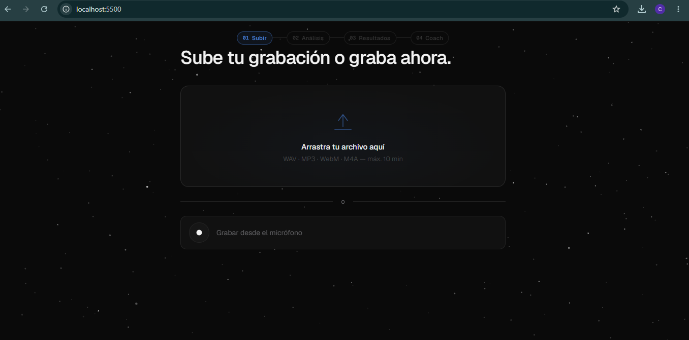
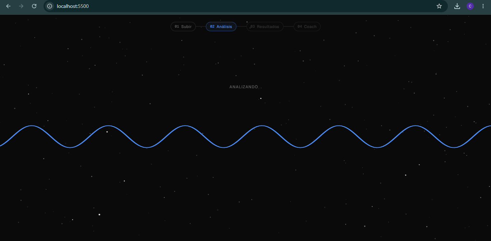
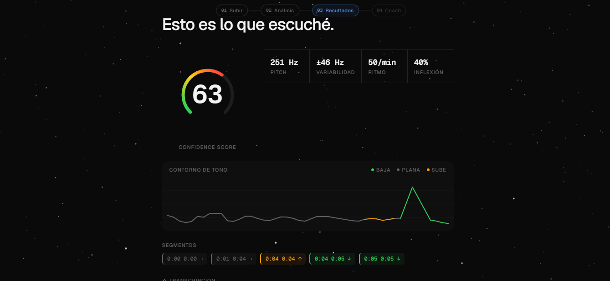
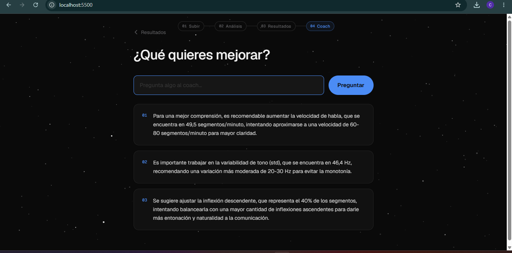

# VoiceLens — Analizador de Voz con IA
Proyecto Final · Introducción a la Inteligencia Artificial 2026-1 · EAFIT

## 1. Planteamiento del problema
Praat requiere formación en fonética. Gong cuesta miles de dólares. La mayoría de personas nunca recibe feedback objetivo sobre su propia voz. VoiceLens resuelve eso: subís un audio y en segundos obtenés métricas reales de tu habla más tres recomendaciones concretas de un coach de IA.

## 2. Objetivo general
Construir una app web que transcriba voz, extraiga features acústicos (pitch, energía, inflexión) y genere feedback en lenguaje natural usando redes neuronales, ML clásico, búsqueda y PLN, todo corriendo desde el navegador sin instalación.

## 3. Metodología
```
Audio → Whisper large-v3-turbo (Groq) ──────────────────► transcripción
Audio → pYIN + RMS + split + linregress ─────────────────► métricas
transcripción + métricas → LLaMA 3.1-8b (Groq) ─────────► 3 recomendaciones
```
El frontend llama `/transcribe` y `/analyze` en paralelo (Promise.all) para reducir latencia.

## 4. Desarrollo
`librosa.pyin` extrae el contorno F0 frame a frame. `effects.split` divide el audio por silencios (top_db=25). Para cada segmento, `scipy.stats.linregress` sobre el último 40% del contorno clasifica la inflexión final como downward, upward o flat usando umbrales calibrados (slope < -8 Hz/s, |r| > 0.45). Una búsqueda lineal O(n) con `argmax`/`argmin` localiza el mejor y peor segmento acústico. El confidence score pondera variabilidad tonal (40%), ratio de inflexión descendente (35%) y energía RMS (25%). LLaMA 3.1 recibe las métricas numéricas reales y devuelve exactamente 3 recomendaciones en el idioma del audio.

## 5. Resultados
Pruebas con voz hablada en español: pitch medio 120-180 Hz (rango esperado 80-300 Hz), confidence score 45-75/100, segmentación correcta de pausas naturales. El coach genera recomendaciones específicas al audio analizado, no respuestas genéricas.

## Capturas del sistema

### Subida de audio


### Proceso de análisis


### Resultados acústicos


### Coach de IA


## 6. Discusión
Praat tiene mayor precisión (sub-milisegundo, formantes) pero no genera feedback en lenguaje natural y requiere formación técnica. Gong hace análisis similar orientado a ventas sin exponer métricas de bajo nivel al usuario. El límite de VoiceLens es el confidence score: es una heurística ponderada, no un modelo entrenado con datos etiquetados de confianza percibida real.

## Temas del curso
- Redes neuronales: Whisper large-v3-turbo (transformer encoder-decoder) via Groq
- Optimización: beam search dentro de Whisper para decodificación de tokens
- Aprendizaje de máquina: features acústicos + clasificación por regresión lineal y umbrales
- Búsqueda: `argmax`/`argmin` sobre segmentos para localizar el mejor/peor fragmento
- PLN + bot: LLaMA 3.1 interpreta métricas numéricas → recomendaciones en lenguaje natural

## Instalación
```bash
pip install fastapi uvicorn librosa numpy scipy groq python-multipart soundfile python-dotenv
# Crear .env con: GROQ_API_KEY=tu_clave  (gratuita en console.groq.com)
uvicorn main:app --reload
```
Abrir `index.html` en el navegador.
